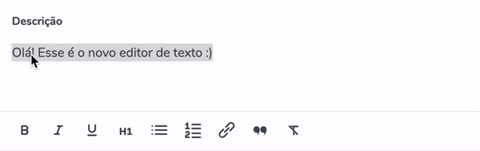

# Hello there! I'm Matheus! 👾

<section display="flex">
    

        
        As I said, my name is Matheus Leonardo and I'm from Brazil 🇧🇷! I started programming in 2020 during college and embrace it, because I loved it and I love to help people and, through it, I can help many of them.
         
         
        Today, I work as an intern on a Brazilian edtech named  <a href="https://layers.education" target="_blank" rel="noopener noreferrer">
        Layers Education,</a> and I pursue the dream to become a Cadet at <a href="https://42sp.org.br" target="_blank" rel="noopener noreferrer">
        42Sp</a>.
    

</section>

## What I like to do?

I have many hobbies (maybe too many hobbies): I love to learn about programming, sciences and storytelling - stories and myths are what shapes us.

    <blockquote>
        <b><i>Creativity is intelligence having fun!</i></b> 
        -- Albert Einstein
    </blockquote>

## What I have been using?

### Languages & Frameworks

### OS & Tools

That is what I have already seen, but I do not plan to stop here! I will hold on to my studies to learn more and more.

## What I have already done?

One of my projects that you can check is my [personal portfolio](https://matheusleo.github.io/my-profile/) - which I will update and, maybe, release a version 2.0 with a new design and using new tools.

Another one of my projects was this Text Editor which is currently being used on the Super App by [Layers Education](https://layers.education)

